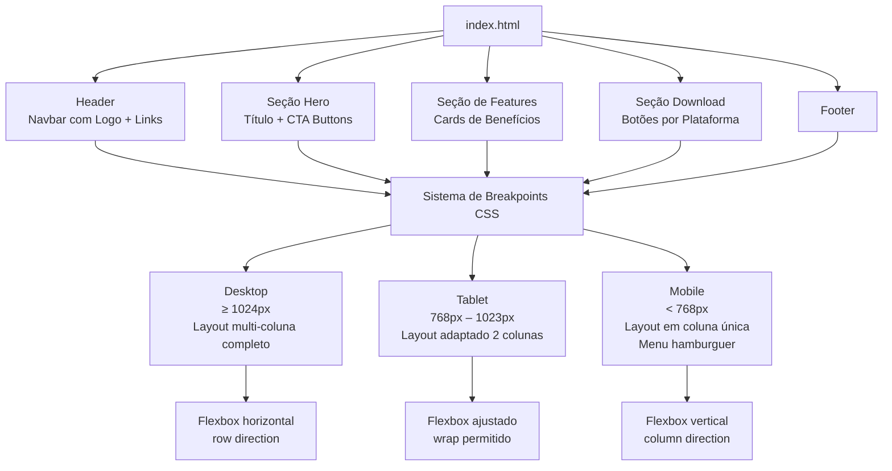
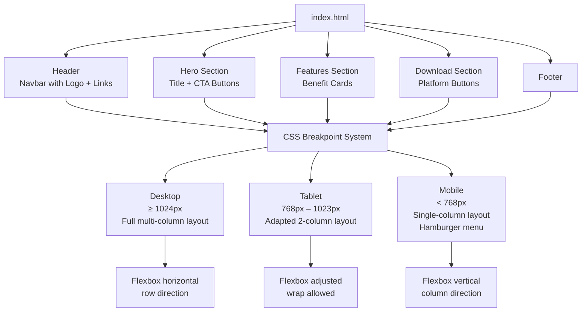

# Projeto - Pagina Responsiva Inspirada no Discord

<div align="center">


</div>

Este projeto foi desenvolvido como parte de um desafio da DIO, com o objetivo de colocar em prática os conceitos de **CSS Responsivo**. A proposta era reproduzir visualmente a página principal do Discord, mas com liberdade criativa para adaptar o layout com minha identidade como estudante universitário de Ciência de Dados.

## 🎯 Objetivo

Com esse projeto, pude aplicar na prática:
- Media queries
- Layouts flexíveis com Flexbox
- Princípios de design responsivo
- Separação de responsabilidades com HTML e CSS

Entender e aplicar esses conceitos é super útil, principalmente para quem quer apresentar dashboards e visualizações de dados em diferentes dispositivos.

## 📱 Tecnologias Utilizadas

- HTML5
- CSS3 (com media queries)
- Baseado no Figma oficial do desafio

## 🔗 Protótipo de Referência

[Figma Oficial do Desafio](https://www.figma.com/file/NRBYrG5d4DSzObv7dpTqoM/Desafio-Responsividade---DIO)

## 🗺️ Breakpoints Responsivos e Componentes do Layout



## 🚀 Como executar

1. Clone este repositório
2. Abra o arquivo `index.html` no navegador
3. Redimensione a janela e veja a mágica da responsividade acontecer

## 📋 Descrição

Este repositório contém o código-fonte de uma página responsiva inspirada no Discord, desenvolvida com HTML5 e CSS3. O foco do projeto é a aplicação de media queries e Flexbox para garantir que o layout se adapte perfeitamente a diferentes tamanhos de tela, desde desktops até dispositivos móveis.

## 📦 Instalação

1. **Clone o repositório:**
   ```bash
   git clone https://github.com/galafis/Construindo-um-Layout-Responsivo-Para-o-Site-do-Discord-Com-CSS.git
   ```
2. **Navegue até o diretório do projeto:**
   ```bash
   cd Construindo-um-Layout-Responsivo-Para-o-Site-do-Discord-Com-CSS
   ```
3. **Abra o arquivo `index.html` no seu navegador.**

## 💻 Uso

Após abrir o arquivo `index.html` no navegador, redimensione a janela para observar os breakpoints responsivos em ação. O layout se reorganiza automaticamente conforme o tamanho da tela, demonstrando o poder das media queries e do Flexbox na construção de interfaces modernas.

## 📄 Licença

Este projeto está licenciado sob a Licença MIT. Consulte o arquivo `LICENSE` para mais detalhes.

---

Desenvolvido com dedicação por um futuro cientista de dados curioso pelo universo do front-end 👨‍💻

---

# Project - Responsive Page Inspired by Discord 💬

This project was developed as part of a DIO challenge, with the goal of putting into practice the concepts of **Responsive CSS**. The proposal was to visually reproduce the main Discord page, but with creative freedom to adapt the layout with my identity as a Data Science university student.

## 🎯 Objective

With this project, I was able to apply in practice:
- Media queries
- Flexible layouts with Flexbox
- Responsive design principles
- Separation of responsibilities with HTML and CSS

Understanding and applying these concepts is very useful, especially for those who want to present dashboards and data visualizations on different devices.

## 📱 Technologies Used

- HTML5
- CSS3 (with media queries)
- Based on the official challenge Figma

## 🔗 Reference Prototype

[Official Challenge Figma](https://www.figma.com/file/NRBYrG5d4DSzObv7dpTqoM/Desafio-Responsividade---DIO)

## 🗺️ Responsive Breakpoints and Layout Components



## 🚀 How to Run

1. Clone this repository
2. Open the `index.html` file in your browser
3. Resize the window and watch the responsiveness magic happen

## 📋 Description

This repository contains the source code for a responsive page inspired by Discord, developed with HTML5 and CSS3. The project focuses on applying media queries and Flexbox to ensure the layout adapts perfectly to different screen sizes, from desktops to mobile devices.

## 📦 Installation

1. **Clone the repository:**
   ```bash
   git clone https://github.com/galafis/Construindo-um-Layout-Responsivo-Para-o-Site-do-Discord-Com-CSS.git
   ```
2. **Navigate to the project directory:**
   ```bash
   cd Construindo-um-Layout-Responsivo-Para-o-Site-do-Discord-Com-CSS
   ```
3. **Open the `index.html` file in your browser.**

## 💻 Usage

After opening the `index.html` file in the browser, resize the window to observe the responsive breakpoints in action. The layout automatically reorganizes according to the screen size, demonstrating the power of media queries and Flexbox in building modern interfaces.

## 📄 License

This project is licensed under the MIT License. See the `LICENSE` file for more details.

---

**Author:** Gabriel Demetrios Lafis
